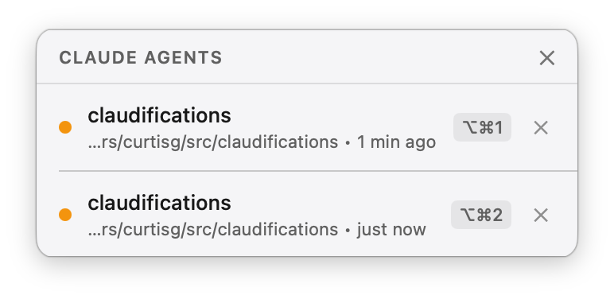
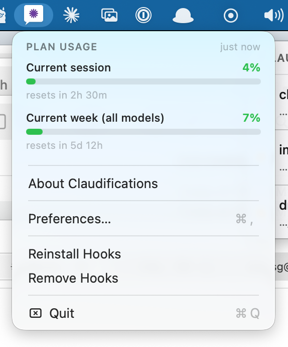

# Claudifications

A native macOS app that watches all your running [Claude Code](https://claude.ai/code) CLI sessions and shows a floating panel whenever one is waiting for your input — so you can see at a glance which agents need attention and jump straight to them.



## What it does

- **Floating notification panel** (top-right, non-focus-stealing) lists every Claude session waiting for input, with project name, git branch, working directory, and how long it's been waiting — the branch is what tells two agents in the same repo apart
- **Sound alert** plays when the panel first appears, not on subsequent updates
- **Click to jump** directly to the right iTerm2 tab/pane
- **Jump from the keyboard** with ⌃⌥1–9 anywhere in the system; each row shows
  its own shortcut, and the modifiers are configurable in Preferences —
  Control-Option is the default because it is the only offered combination that
  Preview, Messages, Finder and Xcode don't already bind to 1–9
- **Dismiss** individual sessions (✕ per row) or all at once (✕ in header)
- **Menu bar icon** for quick access and preferences
- **Plan usage meters** at the top of the menu bar dropdown — the same
  "Current session" and "Current week (all models)" figures `/usage` reports,
  as colored bars with a countdown to each reset



## How it works

```
Claude Code session
  → Stop / Notification hook fires fleet-status.sh
  → Writes ~/.claude/fleet-status/<session_id>.json  { state: "waiting" }
  → Claudifications polls for file changes
  → Panel appears / updates
```

When you act on a session (click or dismiss), the state is updated to `"dismissed"` and the row disappears.

Plan usage rides a separate path, because Claude Code exposes subscription
limits only to the status line — not to hooks:

```
Claude Code session (re-renders its status line)
  → pipes session JSON, incl. a `rate_limits` block, to usage-statusline.py
  → writes ~/.claude/claudifications/usage.json
  → Claudifications reads it when you open the menu bar dropdown
```

Two things follow from that. The readout only refreshes while a session is on
screen, so it is dimmed once the reading is over 15 minutes old — and if a
usage window has reset since the last reading, that bar shows `—` rather than a
stale number. Claude Code also only sends `rate_limits` to subscribers, and only
after a session's first API response, so a brand-new install shows nothing until
you have used a session.

### What it can't show

`rate_limits` carries exactly two windows, `five_hour` and `seven_day`, which
correspond to `/usage`'s **Current session** and **Current week (all models)**
rows (verified by matching their reset timestamps). `/usage`'s third row,
**Current week (Fable)**, has no equivalent — the per-model breakdown exists
only behind an authenticated `GET /api/oauth/usage`, which would require reading
and refreshing your OAuth credentials from the Keychain. Refreshing a token
another process owns risks invalidating the CLI's own credentials, so this app
deliberately doesn't go there.

## Prerequisites

- macOS 13+
- [Claude Code CLI](https://claude.ai/code) with hooks support
- [iTerm2](https://iterm2.com) — optional, required for click-to-jump
- Xcode or `xcodegen` + `xcodebuild` to build from source

## Installation

### Download a release

Grab `Claudifications.zip` from the [latest release](https://github.com/curtisgalloway/claudifications/releases/latest),
unzip it, and move `Claudifications.app` to `/Applications`.

Release builds are signed with an Apple Developer ID and notarized by Apple, so
they open normally — no `xattr` dance and no Privacy & Security override.

Then launch the app and choose **Install Hooks** from the menu bar icon.

### Build from source

```bash
git clone https://github.com/curtisgalloway/claudifications.git
cd claudifications
./install.sh
```

Then follow the printed next steps (launch the app and wire the hooks in `settings.json`).

### Manual build

```bash
make install   # builds and copies to /Applications
```

Then install the hook and wire `settings.json` manually:

**Install the hook**

```bash
mkdir -p ~/.claude/hooks
cp hooks/fleet-status.sh hooks/usage-statusline.py ~/.claude/hooks/
chmod +x ~/.claude/hooks/fleet-status.sh ~/.claude/hooks/usage-statusline.py
```

**Wire the hook in `~/.claude/settings.json`**

```json
{
  "hooks": {
    "Stop": [
      {"hooks": [{"type": "command", "command": "~/.claude/hooks/fleet-status.sh waiting"}]}
    ],
    "Notification": [
      {"hooks": [{"type": "command", "command": "~/.claude/hooks/fleet-status.sh waiting"}]}
    ],
    "PreToolUse": [
      {"hooks": [{"type": "command", "command": "~/.claude/hooks/fleet-status.sh working"}]}
    ]
  },
  "statusLine": {"type": "command", "command": "~/.claude/hooks/usage-statusline.py"}
}
```

Claude Code allows exactly one status line. **Install Hooks** in the menu will
never overwrite an existing one — it tells you instead. To run both, have your
own status line also invoke `~/.claude/hooks/usage-statusline.py`; it prints a
compact `5h 12%  7d 34%` summary you can append to your own output.

## Optional: Suppress duplicate iTerm2 notifications

The Claude Code `Notification` hook can also trigger iTerm2's own notification system. To suppress the duplicate:

iTerm2 → Settings → Profiles → Terminal → Filter Alerts → uncheck **"Send escape sequence-generated alerts"**

## File layout

```
~/.claude/
  settings.json           ← hook + statusLine wiring lives here
  hooks/
    fleet-status.sh       ← writes session state files (this repo)
    usage-statusline.py   ← writes plan usage (this repo)
  fleet-status/
    <session_id>.json     ← per-session runtime state, auto-managed
  claudifications/
    usage.json            ← latest plan usage reading, auto-managed
```

`usage.json` sits outside `fleet-status/` on purpose: the app sweeps that
directory and deletes anything that isn't a valid session record.

## Troubleshooting

**Panel never appears**
- Verify the hook fires: run `claude` in a terminal, let it stop, then check `ls ~/.claude/fleet-status/`
- Confirm `settings.json` has the hooks and is valid JSON

**Plan usage shows "No reading yet"**
- The status line only runs in an interactive session — `claude -p` won't trigger it
- Confirm the wiring: `~/.claude/hooks/usage-statusline.py` exists and `statusLine` in `settings.json` points at it
- Check for a reading: `cat ~/.claude/claudifications/usage.json`
- `rate_limits` reaches the status line only for Claude subscribers, and only after the session's first API response

**iTerm2 jump doesn't work**
- Make sure iTerm2 has Automation permission: System Settings → Privacy & Security → Automation → Claudifications → iTerm2 ✓
- The jump uses `ITERM_SESSION_ID` from the environment when Claude Code starts — it only works in sessions launched from iTerm2

## Releasing

`.github/workflows/build.yml` builds every push to `main` and every PR, and
attaches the built app as a workflow artifact.

To cut a release, push a tag:

```bash
git tag v1.2.3
git push origin v1.2.3
```

`.github/workflows/release.yml` builds it, stamps `CFBundleShortVersionString`
from the tag (minus the leading `v`) and `CFBundleVersion` from the run number,
signs and notarizes the bundle, packages it with `ditto`, and publishes a
GitHub Release with install instructions and a SHA-256.

The `MARKETING_VERSION` / `CURRENT_PROJECT_VERSION` values in `project.yml` are
placeholders for local builds — only tagged CI builds carry a real version.

### Signing and notarization

Local builds are ad-hoc signed (`CODE_SIGN_IDENTITY: "-"`), so a clone builds
and runs with no Apple account. Only `release.yml` signs for real: it re-signs
the finished bundle with the Developer ID identity, submits it to Apple's
notary service, staples the ticket to the `.app`, and only then zips it.
`build.yml` deliberately stays unsigned — PRs from forks can't read secrets.

The hardened runtime is on for every configuration, which is why
`Claudifications/Claudifications.entitlements` exists: `com.apple.security.automation.apple-events`
is what lets click-to-jump drive iTerm2. Building locally with the same setting
means an entitlement problem shows up on your machine, not in a release.

Five repository secrets drive it (Settings → Secrets and variables → Actions):

| Secret | What it holds |
| --- | --- |
| `MACOS_CERT_P12` | base64 of the exported **Developer ID Application** certificate + private key |
| `MACOS_CERT_PASSWORD` | the password set when exporting that `.p12` |
| `APPLE_ASC_KEY_ID` | App Store Connect API **Key ID** |
| `APPLE_ASC_ISSUER_ID` | App Store Connect API **Issuer ID** |
| `APPLE_ASC_KEY_P8` | base64 of the `AuthKey_<KeyID>.p8` file |

To produce them:

**Certificate.** Xcode → Settings → Accounts → your team → Manage Certificates
→ **+** → *Developer ID Application*. Then in Keychain Access, right-click the
new `Developer ID Application: …` identity → Export → `.p12` with a password.

```bash
base64 -i DeveloperID.p12 | pbcopy   # → MACOS_CERT_P12
```

**API key.** App Store Connect → Users and Access → Integrations → App Store
Connect API → **Team Keys** → Generate API Key, role **Developer**. It must be
a *team* key: personal keys are rejected by the notary service. The `.p8`
downloads exactly once.

```bash
base64 -i AuthKey_XXXXXXXXXX.p8 | pbcopy   # → APPLE_ASC_KEY_P8
```

To check a published release from a clean machine:

```bash
spctl --assess --type exec -vvv /Applications/Claudifications.app
# → accepted / source=Notarized Developer ID
```

## License

Apache 2.0 — see [LICENSE](LICENSE).
